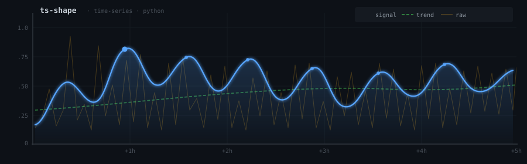

# ts-shape

---

## About

ts-shape is a collection of Python packages for working with time-series data — from ingestion and transformation to validation and export. Our libraries are built to be composable, lightweight, and easy to integrate into data pipelines and analysis workflows.



---

## Quick Start

```sh
pip install ts-shape
```

```python
import pandas as pd
from tsshape import reshape

df = pd.read_csv("sensor_data.csv", parse_dates=["timestamp"])

# Resample, fill gaps, and normalize in one call
result = reshape(df, freq="1min", fill="interpolate", normalize=True)
```

---

## Links

- [GitHub Repositories](https://github.com/ts-shape)
- [PyPI](https://pypi.org/org/ts-shape)
